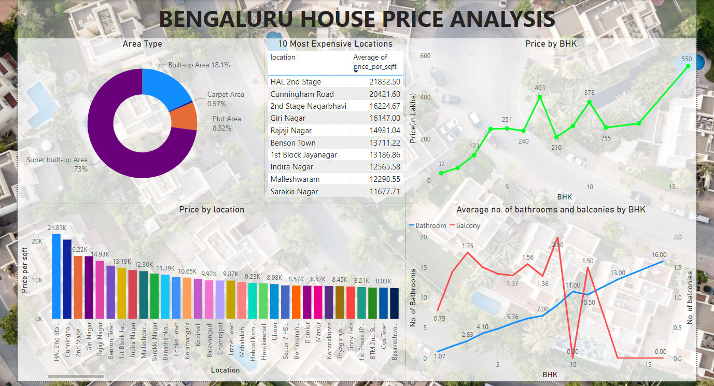

# Bengaluru House Price Prediction

This repository contains the code for a machine learning model that predicts the price of houses in Bengaluru, India. The model was trained using data from the "BengaluruHouseData.xlsx" dataset, which was preprocessed to remove missing values and outliers.

The repository includes the following files:

BengaluruHouseData.xlsx: The original dataset used to train the model.

cleaned dataset.csv: The preprocessed dataset used to create the visual dashboard.

notebook.ipynb: A Jupyter notebook that contains the code for training the model and saving it using the pickle library.

banglore_home_prices_model.pkl: A file containing the trained model that was extracted from the notebook using pickle.

dashboard.pbix: A Power BI file that contains the visual dashboard created using the preprocessed dataset.

The model was trained using six different regression algorithms: Linear Regression, Lasso Regression, Ridge Regression, Decision Tree Regressor, Support Vector Regressor, Random Forest Regressor, and Gradient Boosting Regressor. The hyperparameters of each model were optimized using GridSearchCV.

The best-performing model was selected, and the final model was saved using the pickle library. The preprocessed dataset was then used to create a visual dashboard using Power BI, which allows users to explore the data and make predictions on new house prices.

Please feel free to use the code in this repository for your own projects or to suggest improvements.

